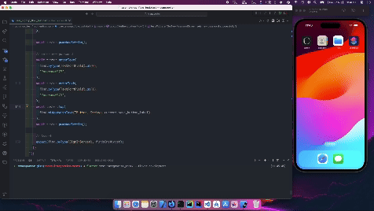

# Transporter

## Table of Contents

0. [Introduction](#introduction)
   - [Features](#features)
1. [Getting Started 🚀](#getting-started-)
2. [Running Tests 🧪](#running-tests-)
   - [Preview (Running Integration Testing)](#preview-running-integration-testing)
3. [Working with Flavors](#working-with-flavors-)
4. [Working with Translations 🌐](#working-with-translations-)
   - [Adding Strings](#adding-strings)
   - [Adding Supported Locales](#adding-supported-locales)
   - [Adding Translations](#adding-translations)
   - [Generating Translations](#generating-translations)
5. [Tools & Libraries Used](#tools--libraries-used)
6. [User Flow](#user-flow-)

---

## Introduction

This a mobile application developed to showcase proficiency in mobile development, UI design implementation, state management, and handling authentication and CRUD operations using Flutter.Additionally, the project demonstrates the ability to implement unit tests and integration tests to ensure the robustness of the application.

## Features

- User Authentication: Secure login and registration.
  - Email or Phone number and Password Sign In
  - Reset Password
- Complaints Management:
  - Create a Complaint: Allow users to create a new complaint with a title and description.
  - Edit a Complaint: Enable users to modify the title or description of an existing complaint.
  - Delete a Complaint: Allow users to delete a complaint from the list.
  - View Complaints: Allow users to view their complaints.
- Responsive Design: Adaptable UI for different screen sizes.

## Getting Started 🚀

```sh
# Clone the repository
$ git clone https://github.com/knowbee/transporter.git
# Change directory
$ cd transporter
# Install dependencies
$ flutter pub get
```

This project contains 3 flavors:

- development
- staging
- production

To run the desired flavor either use the launch configuration in VSCode/Android Studio or use the following commands:

```sh
# Development
$ flutter run --flavor development --target lib/main_development.dart

# Staging
$ flutter run --flavor staging --target lib/main_staging.dart

# Production
$ flutter run --flavor production --target lib/main_production.dart
```

_\*Transporter works on iOS, Android, Web, and Windows._

---

## Running Tests 🧪

To run all unit and widget tests use the following command:

```sh
flutter test --coverage --test-randomize-ordering-seed random
```

To run integration tests run the following command:

```sh
flutter test integration_test/ --flavor development
```

## Preview (Running Integration Testing)



## Working with Flavors 🧩

Flavors are used to manage different environments (development, staging, production) within the Transporter app. This setup ensures that each environment can have distinct configurations, resources, and settings.

## Working with Translations 🌐

This project relies on [flutter_localizations][flutter_localizations_link] and follows the [official internationalization guide for Flutter][internationalization_link].

### Adding Strings

1. To add a new localizable string, open the `intl_en.arb` file at `lib/l10n/intl_en.arb`.

```arb
{
    "@@locale": "en",
    "transporterAppBarTitle": "Transporter",
    "@transporterAppBarTitle": {
        "description": "Text shown in the AppBar of the transporter Page"
    }
}
```

2. Then add a new key/value and description

```arb
{
    "@@locale": "en",
    "transporterAppBarTitle": "transporter",
    "@transporterAppBarTitle": {
        "description": "Text shown in the AppBar of the transporter Page"
    },
    "helloWorld": "Hello World",
    "@helloWorld": {
        "description": "Hello World Text"
    }
}
```

3. Use the new string

```dart
import 'package:transporter/l10n/l10n.dart';

@override
Widget build(BuildContext context) {
  return Text(Strings.of(context).helloWorld);
}
```

### Adding Supported Locales

Update the `CFBundleLocalizations` array in the `Info.plist` at `ios/Runner/Info.plist` to include the new locale.

```xml
    ...

    <key>CFBundleLocalizations</key>
 <array>
  <string>en</string>
  <string>rw</string>
 </array>

    ...
```

### Adding Translations

1. For each supported locale, add a new ARB file in `lib/l10n/arb`.

```
├── l10n
│   │   ├── intl_en.arb
│   │   └── intl_rw.arb
```

2. Add the translated strings to each `.arb` file:

`intl_en.arb`

```arb
{
    "@@locale": "en",
    "transporterAppBarTitle": "transporter",
    "@transporterAppBarTitle": {
        "description": "Text shown in the AppBar of the transporter Page"
    }
}
```

`intl_rw.arb`

```arb
{
    "@@locale": "rw",
    "transporterAppBarTitle": "Mutwazi",
    "@transporterAppBarTitle": {
        "description": "Ijambo rigaragara kuri paji"
    }
}
```

### Generating Translations

To use the latest translations changes, you will need to generate them:

1. Generate localizations for the current project:

```sh
dart run intl_utils:generate
```

Alternatively, run `flutter run` and code generation will take place automatically.

## Tools & Libraries Used

- [Flutter](https://flutter.dev/): Framework for building the mobile application.
- [Bloc](https://pub.dev/packages/flutter_bloc): State management.
- [Hive](https://pub.dev/packages/hive): For local data storage.
- [Intl](https://pub.dev/packages/intl): Internationalization and localization support.
- [Mockito](https://pub.dev/packages/mockito): Mocking library for unit testing.

## User Flow 🚶‍♂️

|  |  |  |  |
| ----------------------------------------------------------------------------------------- | ----------------------------------------------------------------------------------------- | ----------------------------------------------------------------------------------------- | ----------------------------------------------------------------------------------------- |
|  |  |  |  |
| ----------------------------------------------------------------------------------------- | ----------------------------------------------------------------------------------------- | ----------------------------------------------------------------------------------------- | ----------------------------------------------------------------------------------------- |
|  |  |  |  |
| ----------------------------------------------------------------------------------------- | ----------------------------------------------------------------------------------------- | ----------------------------------------------------------------------------------------- | ----------------------------------------------------------------------------------------- |
|  |  |  |  |
| ----------------------------------------------------------------------------------------- | ----------------------------------------------------------------------------------------- | ----------------------------------------------------------------------------------------- | ----------------------------------------------------------------------------------------- |
|  |  |  |  |
| ----------------------------------------------------------------------------------------- | ----------------------------------------------------------------------------------------- | ----------------------------------------------------------------------------------------- | ----------------------------------------------------------------------------------------- |
|  |  |  |
